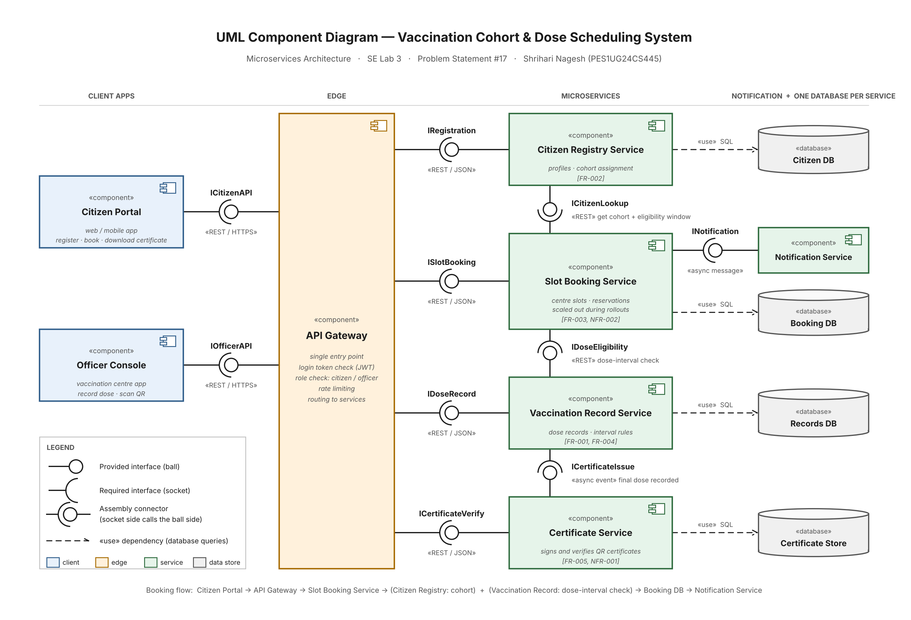

# 2. Architectural Diagram (Lab 3)

**Lab 3:** Component Modelling & Architectural Pattern Selection  
**System:** Vaccination Cohort & Dose Scheduling System (Problem Statement #17)  
**Student:** Shrihari Nagesh | PES1UG24CS445

## Files

| File | What it is |
|---|---|
| `Architecture_Diagram.png` / `.pdf` | UML component diagram |
| `Architecture_Diagram.drawio` | Editable draw.io (diagrams.net) version of the same diagram |
| `Architecture_Justification_Document.docx` / `.pdf` | One-page written justification |
| `Architecture_Specification.md` / `.pdf` | Full specification: style comparison, components, interfaces, data flow |
| `generate_component_diagram.py` | Script that draws the PNG and PDF (Python, matplotlib) |

## Diagram

## Architecture selection

> **We chose Microservices Architecture for the Vaccination Cohort & Dose Scheduling System.**

| Point | Summary |
|---|---|
| Reason 1 | Load is uneven. Only the Slot Booking Service needs extra instances during a cohort rollout (NFR-003) |
| Reason 2 | Fault isolation. If booking is overloaded, officers can still record doses and verify certificates (NFR-004) |
| Security advantage | The certificate signing key lives only inside the Certificate Service, and all traffic passes the API Gateway's token and role check (NFR-002) |
| Performance benefit | Verification is a small separate service, so it stays within 150 ms during booking peaks (NFR-001) |
| Trade-off | More network calls and deployment work. Limited by keeping slot reservation in one service and one database |

## Components (8)

| # | Component | Responsibility |
|---|---|---|
| 1 | Citizen Portal | Register, book a slot, download the certificate |
| 2 | Officer Console | Check in, record a dose, scan a QR certificate |
| 3 | API Gateway | Token check, role check, rate limiting, routing |
| 4 | Citizen Registry Service | Profiles and cohort assignment |
| 5 | Slot Booking Service | Centres, slots, capacity, reservations |
| 6 | Vaccination Record Service | Dose records and dose-interval rules |
| 7 | Certificate Service | Signs and verifies QR certificates |
| 8 | Notification Service | Booking confirmations and reminders |

Each of the four core services owns its own database.

## Interfaces (10)

| # | Interface | Provided by (ball) | Required by (socket) | Protocol |
|---|---|---|---|---|
| 1 | `ICitizenAPI` | API Gateway | Citizen Portal | REST / HTTPS |
| 2 | `IOfficerAPI` | API Gateway | Officer Console | REST / HTTPS |
| 3 | `IRegistration` | Citizen Registry Service | API Gateway | REST / JSON |
| 4 | `ISlotBooking` | Slot Booking Service | API Gateway | REST / JSON |
| 5 | `IDoseRecord` | Vaccination Record Service | API Gateway | REST / JSON |
| 6 | `ICertificateVerify` | Certificate Service | API Gateway | REST / JSON |
| 7 | `ICitizenLookup` | Citizen Registry Service | Slot Booking Service | REST |
| 8 | `IDoseEligibility` | Vaccination Record Service | Slot Booking Service | REST |
| 9 | `ICertificateIssue` | Certificate Service | Vaccination Record Service | Async event |
| 10 | `INotification` | Notification Service | Slot Booking Service | Async message |
