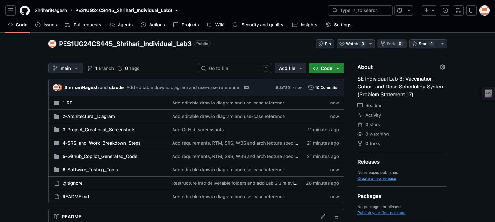

# 3. Project Creation Screenshots: GitHub and Jira

**Problem Statement #17** | Shrihari Nagesh | PES1UG24CS445

Evidence that the GitHub repositories and the three Jira projects were created and used.
The Jira screenshots are the ones included in the Lab 2 reports (stored here as PDFs as well).

## Jira projects

| Project | Key | Template | Used for |
|---|---|---|---|
| `Kanban_BPS#17` | KBPS | Kanban | Requirements, 3 epics, 7 user stories with tasks and sub-tasks |
| `Scrum_BPS#17` | SBPS | Scrum | Prioritised backlog, 39 story points, 2 sprints, burndown chart |
| `Bug_BPS#17` | BBPS | Kanban | 7 defects (BBPS-1 to BBPS-7), each traced to a requirement |

## GitHub (`github/`)

| File | Shows |
|---|---|
| `01_GitHub_Repository_Home.jpg` | This repository's home page with the six folders |
| `02_GitHub_Commit_History.jpg` | Commit history, most recent commits |
| `03_GitHub_Commits_Failing_Test_And_Fix.jpg` | Earlier commits, including the failing-test commit (`6e9ba9f`) and the fix (`630b686`) |
| `04_GitHub_Lab1_Repository.jpg` | The Lab 1 repository (problem statement, requirements table, use-case diagram) |

## Jira Kanban (`jira/`)

| File | Shows |
|---|---|
| `01_Kanban_Board_Requirements_Added.png` | Board with the 7 requirement items in To Do |
| `02_Kanban_Board_Grouped_By_Epic.png` | Board grouped by the 3 epics (KBPS-15, KBPS-16, KBPS-17) |
| `03_Kanban_List_User_Stories.png` | List view with all 7 user stories linked to their epics |
| `04_Kanban_Story_Subtasks.png` | Story 1.1 (Cohort Registration) with its 4 sub-tasks |
| `05_Kanban_Backlog_By_Epic_Part1.png` | Backlog by epic, first part |
| `06_Kanban_Backlog_By_Epic_Part2.png` | Backlog by epic, second part |

## Jira Scrum (`jira/`)

| File | Shows |
|---|---|
| `07_Scrum_Project_Created.png` | New Scrum project with an empty Sprint 1 and backlog |
| `08_Scrum_Epics_Stories_Priority.png` | 3 epics and 7 stories with the Priority column |
| `09_Scrum_Story_Points.png` | Story point estimates, 39 in total |
| `10_Scrum_Sprint2_Active_Board.png` | Sprint 2 board mid-sprint (To Do, In Progress, Done) |
| `11_Scrum_Sprint1_Burndown.png` | Sprint 1 burndown chart, 21 points committed |

## Jira bug tracker (`jira/`)

| File | Shows |
|---|---|
| `12_Bug_Tracker_Board.png` | Board with all 7 bugs: 4 To Do, 2 In Progress, 1 Done |
| `13_Bug_BBPS-1_Detail.png` | Dose 2 booking not blocked at exactly 27-day interval (FR-001) |
| `14_Bug_BBPS-2_Detail.png` | Comorbidity flag ignored during cohort assignment (FR-002) |
| `15_Bug_BBPS-3_Detail.png` | Centre slot allows double-booking at zero remaining capacity (FR-003) |
| `16_Bug_BBPS-4_Detail.png` | Dose record can be saved with an empty batch number (FR-004) |
| `17_Bug_BBPS-5_Detail.png` | QR certificate generated before final dose is administered (FR-005) |
| `18_Bug_BBPS-6_Detail.png` | Certificate verification exceeds 150 ms target under peak load (NFR-001) |
| `19_Bug_BBPS-7_Detail.png` | Citizen health data visible in plaintext in network logs (NFR-002) |

## Lab 2 reports (`jira/`)

| File | Contents |
|---|---|
| `ShrihariNagesh_PES1UG24CS445-BPS17_Kanban.pdf` | Kanban backlog submission |
| `ShrihariNagesh_PES1UG24CS445-BPS17_Scrum.pdf` | Scrum sprint submission with reflection answers |
| `ShrihariNagesh_PES1UG24CS445-BPS17_Bug_Tracking.pdf` | Bug tracking submission |
