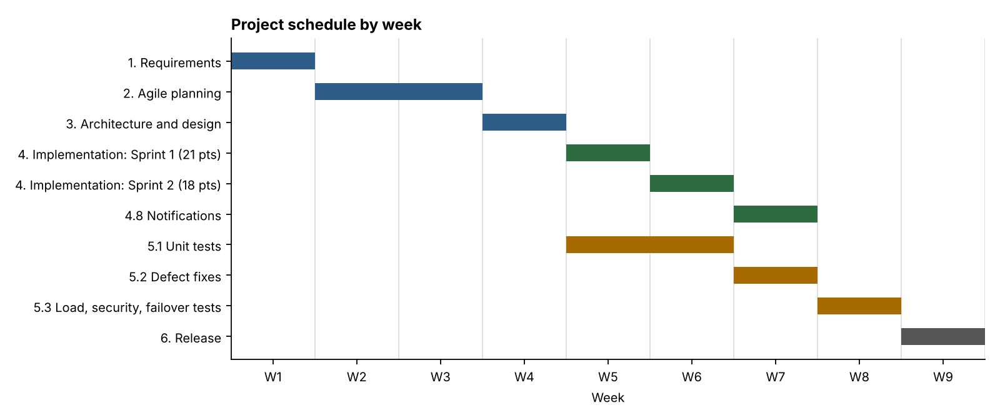

# Work Breakdown Structure (WBS)

**Product:** Vaccination Cohort & Dose Scheduling System (Problem Statement #17)  
**Prepared by:** Shrihari Nagesh, PES1UG24CS445

The project is split into six phases. Phases 1 to 3 match Labs 1 to 3. Phase 4 uses the same seven
stories and story points as the Jira Scrum project (`Scrum_BPS#17`, 39 points in total).

## 1. WBS tree

```text
Vaccination Cohort & Dose Scheduling System
│
├── 1. Requirements
│   ├── 1.1 Analyse the problem statement and actors
│   ├── 1.2 Write the FR and NFR table
│   └── 1.3 Draw the use-case diagram and one use-case flow
│
├── 2. Agile planning
│   ├── 2.1 Kanban board: requirements, epics, user stories
│   ├── 2.2 Scrum backlog: priorities and story points
│   ├── 2.3 Sprint simulation and burndown chart
│   └── 2.4 Bug tracker: log and triage defects
│
├── 3. Architecture and design
│   ├── 3.1 Compare Layered, Client-Server and Microservices
│   ├── 3.2 Draw the UML component diagram
│   ├── 3.3 Specify the interfaces between components
│   └── 3.4 Write the one-page justification
│
├── 4. Implementation
│   ├── 4.1 Citizen registration and cohort assignment
│   ├── 4.2 Dose interval lock
│   ├── 4.3 Centre search and slot booking
│   ├── 4.4 Dose administration check-in
│   ├── 4.5 Digital certificate generation
│   ├── 4.6 Certificate verification
│   ├── 4.7 Citizen data security
│   └── 4.8 Booking notifications
│
├── 5. Testing
│   ├── 5.1 Unit tests for the core rules
│   ├── 5.2 Fix and retest the logged defects
│   └── 5.3 Load, security and failover tests
│
└── 6. Release
    ├── 6.1 Package and deploy the services
    ├── 6.2 Pilot at one vaccination centre
    └── 6.3 Documentation and handover
```

## 2. Work package dictionary

| WBS | Work package | Requirement | Jira story | Story points | Output | Status |
|---|---|---|---|:---:|---|---|
| 1.1 | Analyse problem statement | all | | | Actors and scope | Done (Lab 1) |
| 1.2 | FR and NFR table | all | | | Requirements table | Done (Lab 1) |
| 1.3 | Use-case model | all | | | Use-case diagram, flow spec | Done (Lab 1) |
| 2.1 | Kanban board | baseline 7 | | | 3 epics, 7 stories with tasks | Done (Lab 2) |
| 2.2 | Scrum backlog | baseline 7 | | | Prioritised backlog, 39 points | Done (Lab 2) |
| 2.3 | Sprint simulation | baseline 7 | | | 2 sprints, burndown chart | Done (Lab 2) |
| 2.4 | Bug tracker | baseline 7 | | | 7 defects logged (BBPS-1 to 7) | Done (Lab 2) |
| 3.1 | Style comparison | NFR-001 to 004 | | | Comparison table | Done (Lab 3) |
| 3.2 | Component diagram | all | | | 8 components, 10 interfaces | Done (Lab 3) |
| 3.3 | Interface specification | all | | | Architecture specification | Done (Lab 3) |
| 3.4 | Justification | NFR-001 to 004 | | | One-page document | Done (Lab 3) |
| 4.1 | Registration and cohort | FR-002 | SBPS-2 | 5 | Citizen Registry rules | Core rules built |
| 4.2 | Dose interval lock | FR-001 | SBPS-1 | 3 | Eligibility check | Core rules built |
| 4.3 | Slot booking | FR-003 | SBPS-3 | 8 | Booking engine | Core rules built |
| 4.4 | Dose check-in | FR-004, NFR-005 | SBPS-4 | 5 | Dose recording | Core rules built |
| 4.5 | Certificate generation | FR-005 | SBPS-5 | 8 | Signed QR payload | Core rules built, PDF export pending |
| 4.6 | Certificate verification | FR-006, NFR-001 | SBPS-6 | 5 | Verification check | Core rules built |
| 4.7 | Data security | NFR-002 | SBPS-7 | 5 | Encryption, RBAC | Planned |
| 4.8 | Notifications | FR-007 | not in backlog | not estimated | Confirmation and reminder | Confirmation built, reminder pending |
| 5.1 | Unit tests | FR-001 to FR-007 | | | 15 automated tests | Done, 15 of 15 pass |
| 5.2 | Defect fixes | baseline 7 | BBPS-1 to 7 | | Regression tests | 6 of 7 have a regression test |
| 5.3 | Load, security, failover tests | NFR-001 to 004 | | | Test reports | Planned |
| 6.1 | Deploy | all | | | Running services | Planned |
| 6.2 | Pilot | all | | | Pilot feedback | Planned |
| 6.3 | Handover | all | | | User and operations guides | Planned |

"Core rules built" means the business logic exists and is unit tested in
[`vaccination_core_engine.py`](../5-Github_Copilot_Generated_Code/vaccination_core_engine.py).
The user interfaces, databases and deployed services are not built.

### Story points by sprint (from Jira)

| Sprint | Stories | Work packages | Points |
|---|---|---|:---:|
| Sprint 1 | SBPS-1, SBPS-2, SBPS-3, SBPS-4 | 4.1, 4.2, 4.3, 4.4 | 21 |
| Sprint 2 | SBPS-5, SBPS-6, SBPS-7 | 4.5, 4.6, 4.7 | 18 |
| **Total** | 7 stories | | **39** |

## 3. Schedule



| Week | Work |
|---|---|
| 1 | Phase 1: requirements |
| 2 to 3 | Phase 2: agile planning |
| 4 | Phase 3: architecture and design |
| 5 | Sprint 1: work packages 4.1 to 4.4, unit tests alongside |
| 6 | Sprint 2: work packages 4.5 to 4.7, unit tests alongside |
| 7 | 4.8 notifications, 5.2 defect fixes |
| 8 | 5.3 load, security and failover tests |
| 9 | Phase 6: deploy, pilot, handover |

**Milestones:** M1 requirements agreed (end of week 1), M2 backlog ready (week 3), M3 architecture
approved (week 4), M4 all stories done (week 6), M5 tests passed (week 8), M6 pilot live (week 9).

**Dependencies:** 4.3 needs 4.1 and 4.2 (booking checks the cohort and the interval). 4.5 needs
4.4 (a certificate needs dose records). 4.6 needs 4.5. 5.3 needs every package in phase 4.

## 4. Risks

| # | Risk | Likelihood | Impact | Response |
|---|---|---|---|---|
| R1 | Booking rush at rollout overloads the system | High | High | Scale only the Slot Booking Service, load test to 5,000 users (5.3) |
| R2 | Two citizens get the last seat | Medium | High | Capacity check and decrement in one atomic step, regression test TC-07 |
| R3 | Certificate signing key leaks | Low | High | Key held only in the Certificate Service, rotate keys |
| R4 | Health authority changes the interval rule | Medium | Medium | Interval is configuration, not code |
| R5 | Personal data exposed in transit (BBPS-7) | Medium | High | TLS on every endpoint, security review before the pilot |
| R6 | Certificate work under-estimated (seen in the Sprint 2 burndown) | Medium | Medium | Keep week 7 as buffer, split story 4.5 if it slips again |
